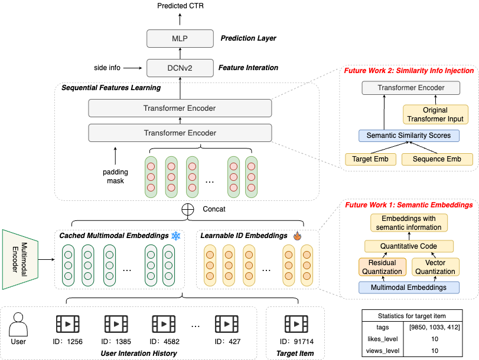
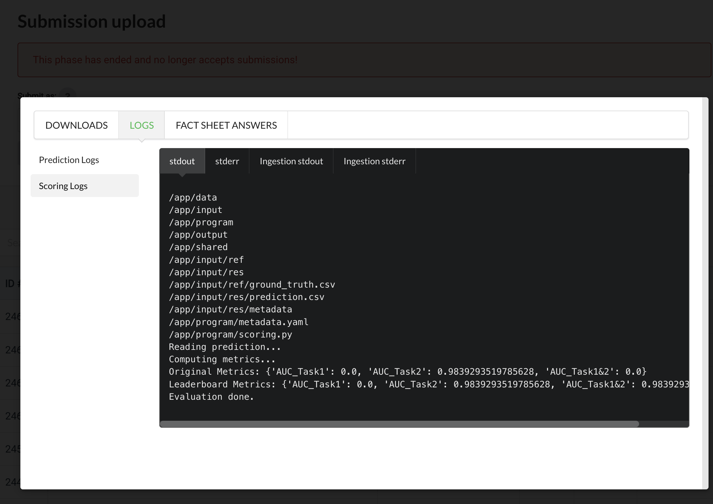

# Task2 Solution of WWW 2025 MMCTR Challenge from Team momo

The WWW 2025 Multimodal CTR Prediction Challenge: https://www.codabench.org/competitions/5372/

The overall architecture of our solution is shown below.



Our model (without future work part) achieves a **0.9839** AUC on the test set.

## Notes & Future Work

Our model is roughly based on **Transformer** and **DCNv2**. 
Two future works can also be seen in the right part of the figure.
- **Semantic embeddings with quantization** (Done, tuning)
  - Due to the success of quantization in computer vision, we believe that quantization can also be applied to multimodal RecSys.
**Vector Quantization** (VQ) and **Residual Quantization** (RQ) are used to quantize the original multimodal embeddings.
Quantization transforms the freezed multimodal embeddings into discrete learnable semantic codes.
  - Codes for quantization are provided in `src/Transformer_DCN_Quant.py` and the tuning work is still in progress.
- **Semantic similarity scores as part of the input of Transformer** (In progress)
  - Multimodal embeddings contain rich semantic information, and users have specific preferences for different semantic information.
Semantic similarity information can be explicitly utilized in our model for better performance.
  - We plan to use **semantic similarity scores** as part of the input of the Transformer part.


Both of the two future works are dedicated to utilizing the semantic information of the multimodal representations.

We believe that these two directions have huge potential.
And works on these two directions **are still ongoing** even after the challenge.

## Environment

We run the experiments on a customized 4080 Super GPU server with 32GB memory from [AutoDL](https://www.autodl.com/).

Requirements:

- fuxictr==2.3.7
- numpy==2.2.3
- pandas==2.2.3
- scikit_learn==1.4.0
- torch==1.13.1+cu117

Environment setup:

```
conda create -n fuxictr_momo python==3.9
pip install -r requirements.txt
source activate fuxictr_momo
```

## How to Run

1. Train the model on train and validation sets:

    ```
    python run_expid.py --config config/Transformer_DCN_microlens_mmctr_tuner_config_01 --expid Transformer_DCN_MicroLens_1M_x1_001_820c435c --gpu 0
    ```
    
    We got the best validation AUC: 0.976603.

2. Make predictions on the test set:

    ```
    python prediction.py --config config/Transformer_DCN_microlens_mmctr_tuner_config_01 --expid Transformer_DCN_MicroLens_1M_x1_001_820c435c --gpu 0
    ```

3. Submission result on [the leaderboard](https://www.codabench.org/competitions/5372/#/results-tab).

   In particular, we got a 0.9814 result (Submission ID: 246140) for un-tuned Residual Quantization (RQ) model (part of future work 1).

4. 